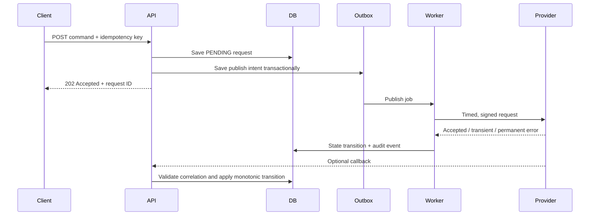

# Asynchronous Provisioning

## Context and assumptions

Assume an application asks an external provider to create or change a service. The provider may be slow, return transient errors, deliver callbacks out of order, or process a request after the client retries.

## Workflow

## State model

`PENDING → SUBMITTED → ACTIVE` is the happy path. `PENDING → FAILED` represents a permanent validation/provider failure. A retryable error leaves the order pending while recording the attempt. Every transition should be validated; callbacks must not move an order backwards without an explicit reconciliation rule.

## Idempotency and retries

The idempotency key is stored with the request result and scoped to the caller/operation. A retry returns the existing request rather than creating a second provider operation. Retry only errors classified as transient, with bounded exponential backoff and jitter. Never retry a non-idempotent provider call without a provider-side idempotency mechanism or reconciliation step.

## Operational controls

- Correlation ID from API request through worker and provider call.
- Timeout and circuit-breaker policy for provider calls.
- Dead-letter queue with a replay procedure.
- Audit events for request, attempt, response, callback, and terminal state.
- Metrics for queue age, retries, provider latency, and stuck states.
- Reconciliation job for uncertain provider outcomes.

## Trade-offs

Asynchronous processing improves request latency and isolates provider slowness, but clients must understand eventual consistency and status polling/webhooks. An outbox adds storage and operational work, but closes the gap between a database commit and a queue publish.
