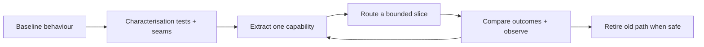

# Legacy Modernisation

## Context and assumptions

Assume a revenue-critical monolith with shared database tables, limited automated tests, and integrations that cannot tolerate a long outage. The goal is safer change and clearer ownership, not a rewrite for its own sake.

## Strangler sequence

## Safe sequence

1. Inventory critical flows, dependencies, data ownership, and rollback options.
2. Add characterisation tests around behaviour that must not change.
3. Introduce an anti-corruption layer at one integration boundary.
4. Extract a capability with an explicit owner and contract.
5. Run shadow reads or dual calculations where correctness can be compared safely.
6. Shift traffic gradually, observe, and keep a rollback path.
7. Retire the old path only after evidence and data reconciliation.

## What not to do

- Split services before boundaries and ownership are understood.
- Change schema and application behaviour in one irreversible deployment.
- Treat a green unit-test suite as proof of integration correctness.
- Copy hidden coupling into a new service and call it modernisation.

## Measures of progress

Use evidence such as deployment lead time, change failure rate, recovery time, test coverage of critical paths, integration error rate, and number of manual recovery steps. Baselines and time windows must be documented before reporting improvement.

## Trade-offs

Incremental modernisation takes longer to explain and temporarily increases integration complexity. It is often safer than a rewrite because each slice can be validated and rolled back while the business continues operating.
