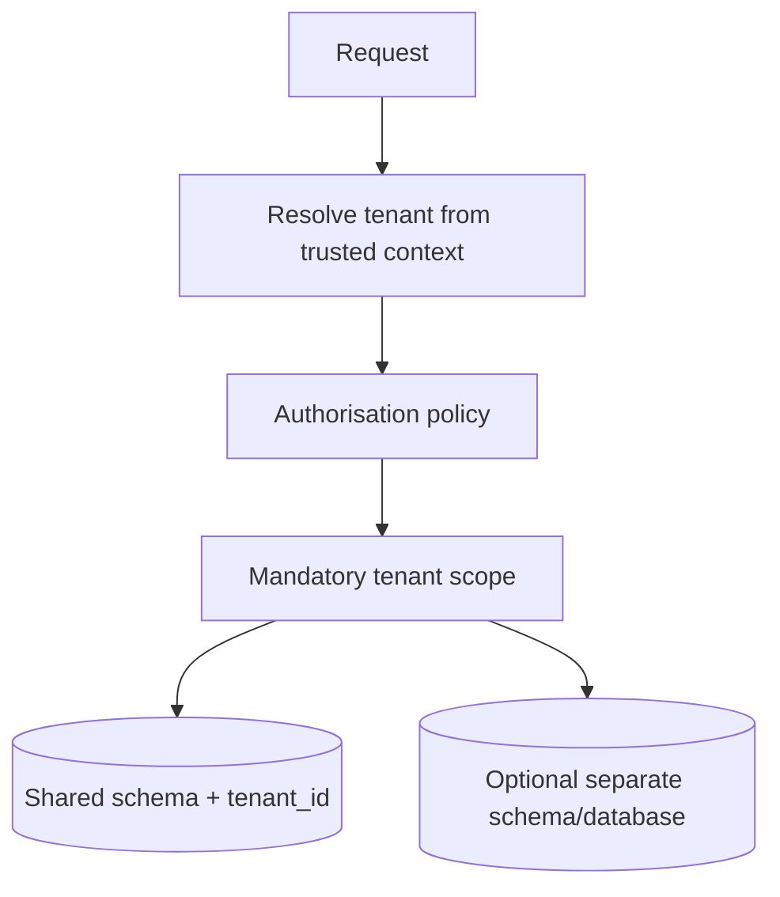

# Multi-tenant SaaS

## Context and assumptions

Assume a SaaS product serves organisations with users, roles, and project data. Tenants need logical isolation, administrators need auditable membership changes, and the product may later require stronger isolation for regulated customers.

## Isolation options

Start with a shared schema and mandatory `tenant_id` on tenant-owned tables when the threat model and operational scale permit it. Centralise tenant resolution and make repository queries require an explicit scope. A separate schema or database can be introduced for selected tenants when regulatory, noisy-neighbour, or backup requirements justify the cost.

## Data rules

- Every tenant-owned table has a non-null tenant key and an index designed around common access paths.
- Composite unique constraints include the tenant key (`tenant_id`, `external_key`).
- Cross-tenant references are rejected at the application and database boundary.
- Background jobs carry tenant context explicitly; workers must not infer it from mutable global state.
- Support tooling requires a separately audited break-glass path.

## Authorisation model

Roles are coarse defaults, not the whole security model. A policy should evaluate identity, tenant membership, role, resource ownership, and token ability. Membership changes should be auditable and invalidate cached permissions.

## Failure and privacy considerations

The most damaging failure is a correct-looking response for the wrong tenant. Tests should include cross-tenant reads and writes, not only happy-path membership. Logs, exports, caches, search indexes, and object-storage keys must all carry tenant boundaries. Data retention and deletion should be explicit product decisions.

## Trade-offs

Shared schema is efficient for migrations and operations but makes query discipline critical. Database-per-tenant improves blast-radius isolation but increases provisioning, migration, backup, and observability complexity. The choice should be revisited when customer requirements—not status signalling—change.
