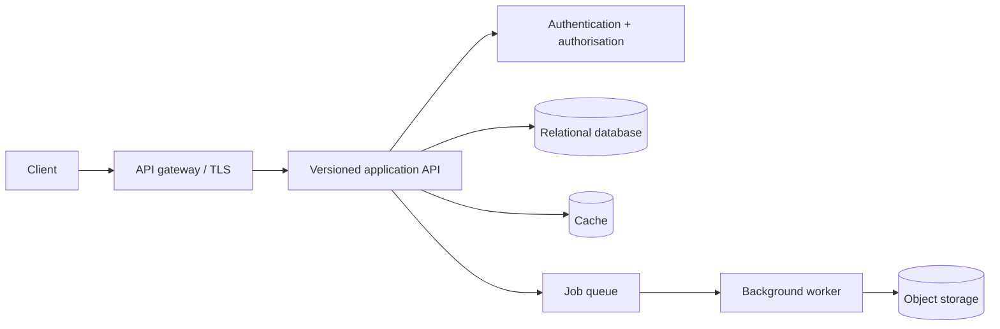

# Scalable REST API

## Context and assumptions

Assume a product exposes a public API to browser clients, a mobile client, and a small number of partner integrations. The domain is intentionally generic: clients manage resources and request asynchronous exports. Exact traffic, latency, and retention figures must be supplied by a real product team before capacity planning.

## Proposed design

The public contract is versioned (`/v1/...`). Controllers translate HTTP concerns into application commands; domain rules do not depend on the transport. Cursor pagination, stable error envelopes, request IDs, and idempotency keys are part of the contract where operations can be retried.

## API contract principles

- Use nouns and predictable HTTP status codes.
- Return a stable error shape with a machine-readable code and request ID.
- Validate at the boundary and re-check invariants inside the application.
- Use cursor pagination for changing collections.
- Require idempotency keys for externally-triggered creation commands.
- Deprecate fields with a documented sunset period rather than silently changing meaning.

## Failure modes

| Failure | Handling | Operator signal |
| --- | --- | --- |
| Database unavailable | Return a bounded 503; do not retry unsafe writes blindly | DB error rate and pool saturation |
| Cache unavailable | Fall back to the source of truth where safe | Cache error and hit-rate metrics |
| Queue unavailable | Persist an outbox record or return a clear retryable response | Queue publish failures |
| Slow downstream | Enforce timeouts and cancellation | Latency percentiles and timeout count |
| Duplicate request | Idempotency record returns the original result | Duplicate-key counter |

## Security and operability

Authentication proves caller identity; authorisation checks resource scope. Rate limits should be per identity and endpoint risk. Logs must contain correlation IDs and outcome metadata, not tokens or sensitive payloads. A deployment should expose health/readiness separately from business metrics.

## Alternatives considered

- **GraphQL:** useful for client-shaped reads, but a versioned REST contract is a simpler first boundary for partner integrations.
- **Microservices immediately:** rejected without independent ownership or scaling pressure; a modular application can preserve boundaries at lower operational cost.
- **Synchronous exports:** rejected because large work should not tie up request workers.

## What to measure before changing the design

Collect request rate, latency by route, error rate, payload sizes, queue depth, database contention, and cache hit rate. Capacity decisions should follow observed bottlenecks, not generic architecture fashion.
